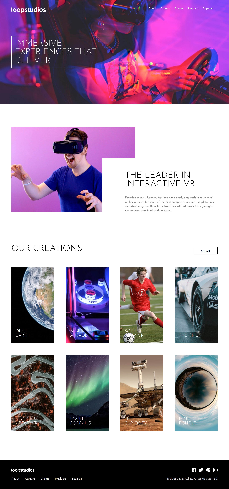

# Frontend Mentor - Loopstudios landing page solution

This is a solution to the [Loopstudios landing page challenge on Frontend Mentor](https://www.frontendmentor.io/challenges/loopstudios-landing-page-N88J5Onjw). Frontend Mentor challenges help you improve your coding skills by building realistic projects. 

## Table of contents

- [Overview](#overview)
  - [The challenge](#the-challenge)
  - [Screenshot](#screenshot)
  - [Links](#links)
- [My process](#my-process)
  - [Built with](#built-with)
  - [What I learned](#what-i-learned)
  - [Continued development](#continued-development)
  - [AI Collaboration](#ai-collaboration)
- [Author](#author)
- [Acknowledgments](#acknowledgments)


## Overview

### The challenge

Users should be able to:

- View the optimal layout for the site depending on their device's screen size
- See hover states for all interactive elements on the page

### Screenshot




### Links

- Solution URL: [Solution here](https://github.com/nqbinh98/loopstudios-landing-page)
- Live Site URL: [Live site here](https://your-live-site-url.com)

## My process

### Built with

- Semantic HTML5 markup
- CSS custom properties (Variables)
- Flexbox
- CSS Grid (Desktop multi-column layouts & image overlays)
- SCSS / SASS (Modular architecture with partials)
- Mobile-first workflow
- Vanilla JavaScript (for mobile navigation toggle)


### What I learned
Throughout this project, I strengthened my skills in handling complex layout structures and responsive design. 

One key highlight was implementing a full-screen mobile menu overlay that breaks out of standard container constraints using `position: fixed`:

<!-- ```scss
.wrapper-nav {
    display: none;
    position: fixed;
    top: 0;
    left: 0;
    width: 100vw;
    height: 100vh;
    background-color: var(--black-color);
    z-index: 100;
    
    &.active {
        display: flex;
        flex-direction: column;
        justify-content: space-between;
    }
} -->
I also learned how to effectively use CSS Grid to stack background images and header content precisely without relying on traditional background-image properties, as well as positioning interactive titles over grid items in the creations section.

### Continued development
In future projects, I want to focus more on:
- Enhancing web accessibility (ARIA attributes and keyboard navigation for modals/menus).
- Implementing smoother CSS transitions/animations for mobile menu opening and closing.


### AI Collaboration
During the development of this landing page, I collaborated with an AI assistant to:
- Troubleshoot complex CSS stacking and positioning issues related to the mobile navigation overlay.
- Refactor and organize SCSS partial files following a clean folder structure.
- Optimize JavaScript event listeners for clean state management.

## Author

- Website - [nqbinh98](https://github.com/nqbinh98)
- Frontend Mentor - [@nqbinh98](https://www.frontendmentor.io/profile/nqbinh98)


## Acknowledgments

